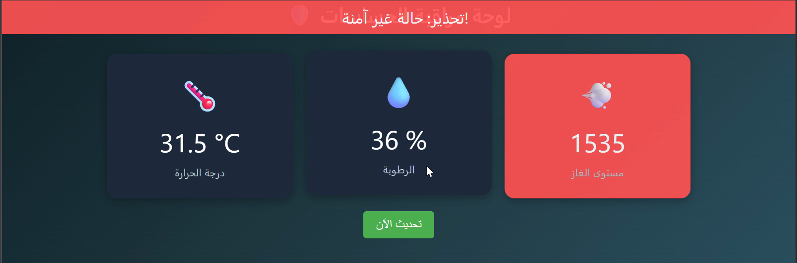

# 🛡️ IoT Safety Monitoring System on ESP32

Arabic: **لوحة مراقبة الحساسات باستخدام ESP32**

## Overview

A smart safety monitoring system using ESP32, DHT11 (temperature & humidity sensor), MQ-2 gas sensor, and a buzzer. The project serves a web dashboard (in Arabic) to display real-time environmental data and alerts for unsafe conditions.

## Features

- **Real-time Monitoring:** Temperature, humidity, and gas levels.
- **Visual Dashboard:** Arabic web interface for easy monitoring (see screenshot below).
- **Alarms:** Buzzer sounds and dashboard warnings for unsafe conditions.
- **WiFi Enabled:** Access data from your local network.

## Hardware Used

- ESP32 Dev Board
- DHT11 Temperature & Humidity Sensor (connected to GPIO4)
- MQ-2 Gas Sensor (Analog to GPIO34, Digital to GPIO5)
- Buzzer (GPIO2)

## Circuit Diagram

_Add your Fritzing/circuit image here (optional)._

## Wiring Table

| Component     | ESP32 Pin |
|---------------|:---------:|
| DHT11 Data    | GPIO4     |
| MQ-2 Analog   | GPIO34    |
| MQ-2 Digital  | GPIO5     |
| Buzzer (+)    | GPIO2     |

## Installation & Usage

1. **Install Libraries** in Arduino IDE:
    - [WiFi.h](https://github.com/espressif/arduino-esp32)
    - [WebServer.h](https://github.com/espressif/arduino-esp32)
    - [DHT sensor library](https://github.com/adafruit/DHT-sensor-library)

2. **Update WiFi Credentials:**
    ```cpp
    const char* ssid = "YOUR_WIFI_SSID";
    const char* password = "YOUR_WIFI_PASSWORD";
    ```

3. **Upload `main.ino` to your ESP32 board.**

4. **Connect to the same WiFi network.**  
   Open a browser and enter the ESP32's IP address (shown in Serial Monitor).

5. **Monitor the dashboard and listen for buzzer alarms.**

## Thresholds

- Max Temperature: 35°C
- Min Humidity: 20%
- Gas Alarm: Analog > 1000 or digital pin LOW

## Dashboard Screenshot

Below is a screenshot of the Arabic web dashboard UI served by the ESP32:



*The dashboard displays real-time sensor data and shows a red warning for unsafe conditions.*

## Credits

- Developed by Abdulrahman Burham for a University IoT project.

## License

MIT
